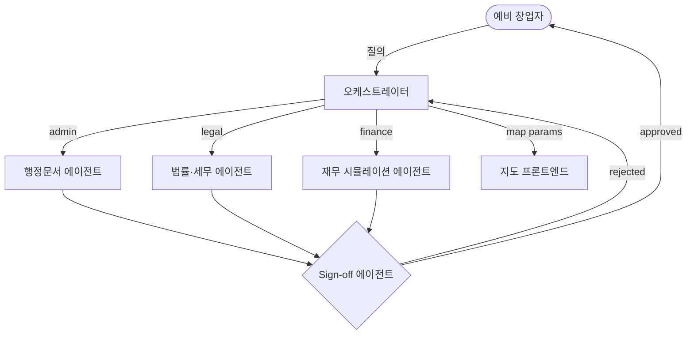

# 시스템 아키텍처

## 전체 워크플로 다이어그램

## 컴포넌트 설명

| 컴포넌트 | 역할 |
|---|---|
| **예비 창업자** | 서비스 최종 사용자. 창업 관련 질의를 입력하고 검증된 응답을 수신. |
| **오케스트레이터** | 질의 도메인을 판별하여 적절한 에이전트로 라우팅. 재시도 루프 및 에스컬레이션 관리. |
| **행정문서 에이전트** | 인허가 절차, 관련 법령 조문, 필요 서류, 담당 기관 등 행정 정보 초안 생성. |
| **법률·세무 에이전트** | 법률 일반 정보 제공, 면책 고지, 법령 인용, 전문가 상담 권고 포함 초안 생성. |
| **재무 시뮬레이션 에이전트** | 수치 기반 재무 분석, 시나리오(낙관/기준/비관), 리스크 경고 포함 초안 생성. |
| **지도 프론트엔드** | 상권 분석·입지 조건 등 지리 기반 파라미터를 시각화하는 UI 컴포넌트. |
| **Sign-off 에이전트** | 도메인별 루브릭(C1–C5 공통 + 도메인 특화 코드)으로 초안을 평가. 승인 시 사용자에게 전달, 거절 시 오케스트레이터로 반환하여 재시도 유도. |

## 흐름 요약

1. **질의 수신**: 예비 창업자가 오케스트레이터에 질문을 전송합니다.
2. **도메인 라우팅**: 오케스트레이터가 질문 유형에 따라 행정·법률·재무 에이전트 중 하나로 라우팅하거나, 지도 관련 파라미터는 지도 프론트엔드로 전달합니다.
3. **초안 생성**: 해당 에이전트가 도메인 특화 프롬프트로 응답 초안을 생성합니다.
4. **품질 평가**: Sign-off 에이전트가 초안을 루브릭에 따라 평가하고 JSON 판정 결과를 반환합니다.
5. **승인 또는 재시도**:
   - `approved: true` → 최종 응답을 사용자에게 전달합니다.
   - `approved: false` → `retry_prompt`와 함께 오케스트레이터로 반환, 에이전트가 초안을 재생성합니다 (최대 3회).
6. **에스컬레이션**: 최대 재시도 횟수 초과 시 `ESCALATED` 상태로 인간 검토자에게 전달합니다.
